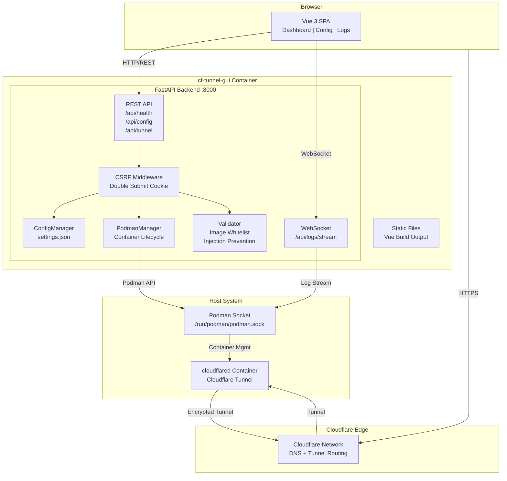
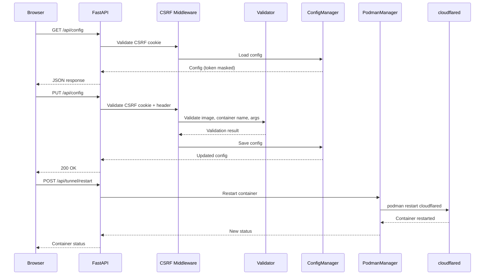
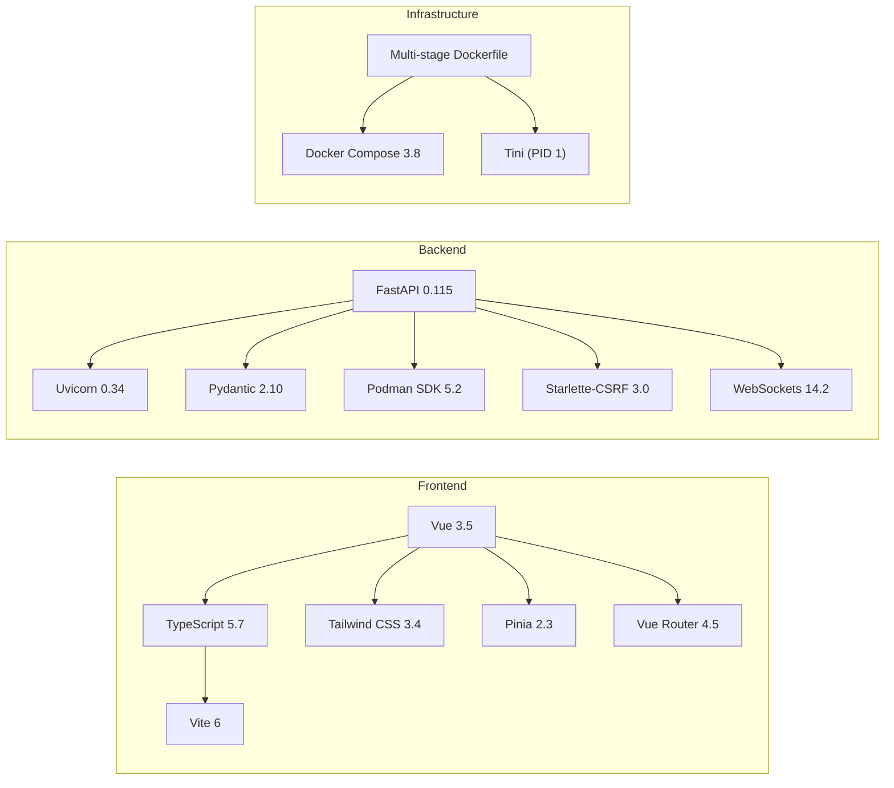

<p align="center">
  
</p>

<h1 align="center">Cloudflare Tunnel Web GUI for Podman</h1>

<p align="center">
  <strong>A modern web interface to manage Cloudflare Tunnel containers via Podman — fully compatible with Home Assistant OS (HAOS) Cloudflared add-on parameters.</strong>
</p>

<p align="center">
  <a href="README_zh-TW.md">繁體中文</a> &bull;
  <a href="#screenshots">Screenshots</a> &bull;
  <a href="#installation">Installation</a> &bull;
  <a href="#architecture">Architecture</a> &bull;
  <a href="#api-reference">API Reference</a>
</p>

<p align="center">
  
  
  
  
  
  
  
</p>

---

## Overview

This project provides a **containerized web GUI** for managing [Cloudflare Tunnel](https://developers.cloudflare.com/cloudflare-one/connections/connect-networks/) (`cloudflared`) through [Podman](https://podman.io/). It replaces manual CLI operations with a clean browser-based interface for tunnel configuration, container lifecycle management, and real-time log streaming.

### Why This Project?

| Challenge | Solution |
|-----------|----------|
| Managing `cloudflared` requires CLI expertise | Web GUI with intuitive forms and toggles |
| Configuration scattered across CLI flags | Centralized config page with validation |
| No visibility into tunnel health | Real-time dashboard with status cards |
| Log inspection requires `podman logs` | Live WebSocket log streaming with filters |
| HAOS Cloudflared add-on parameters not available | Full HAOS parameter compatibility |
| Security risks from manual token handling | Token stored as Podman secret, never written to disk |

## Features

### Dashboard
- Real-time tunnel status monitoring (running / stopped / error)
- Podman connection health check
- Token configuration status
- One-click Start / Stop / Restart controls

### Configuration
- **Basic Settings** — Tunnel token (masked), external hostname, tunnel name, container name, container image (whitelist-validated)
- **Additional Hosts** — Dynamic add/remove of hostname-to-service route mappings with chunked encoding toggle
- **Catch-All Service** — Fallback service URL with Nginx Proxy Manager integration toggle
- **Advanced Settings** — Post-quantum cryptography, 8-level log verbosity, extra CLI arguments
- **Security** — Shell injection prevention, image whitelist, CSRF double-submit cookie protection

### Logs
- Real-time WebSocket-based log streaming
- Filter/search with text highlighting
- Auto-scroll with manual override
- Log download and clear controls
- Connection status indicator

### HAOS Compatibility

All configuration parameters from the [Home Assistant OS Cloudflared add-on](https://github.com/brenner-tobias/addon-cloudflared) are supported:

| HAOS Parameter | GUI Field | Status |
|----------------|-----------|--------|
| `external_hostname` | External Hostname | Supported |
| `additional_hosts` | Additional Hosts (dynamic list) | Supported |
| `tunnel_name` | Tunnel Name | Supported |
| `catch_all_service` | Catch-All Service URL | Supported |
| `nginx_proxy_manager` | Nginx Proxy Manager toggle | Supported |
| `post_quantum` | Post-Quantum Crypto toggle | Supported |
| `log_level` | Log Level dropdown (8 levels) | Supported |

## Architecture

### System Architecture



### Request Flow



### Tech Stack



## Project Structure

```
Woow_cloudflare_tunnel_webgui/
├── backend/
│   ├── main.py                    # FastAPI app entry + CSRF middleware
│   ├── requirements.txt           # Python dependencies
│   ├── models/
│   │   └── schemas.py             # Pydantic models + validators
│   ├── routers/
│   │   ├── config.py              # GET/PUT /api/config
│   │   ├── health.py              # GET /api/health
│   │   ├── logs.py                # WebSocket /api/logs/stream
│   │   └── tunnel.py              # POST /api/tunnel/{start,stop,restart,status}
│   └── services/
│       ├── config_manager.py      # JSON config persistence + merge logic
│       ├── podman_manager.py      # Podman SDK wrapper
│       └── validator.py           # Image whitelist + injection prevention
├── frontend/
│   ├── package.json               # Node.js dependencies
│   ├── vite.config.ts             # Vite build config
│   ├── tailwind.config.js         # Tailwind CSS config
│   └── src/
│       ├── App.vue                # Root component
│       ├── router.ts              # Vue Router config
│       ├── components/            # NavBar, StatusCard, LogViewer, etc.
│       ├── composables/           # useCsrf, useWebSocket
│       ├── pages/                 # Dashboard, Config, Logs
│       ├── stores/                # Pinia stores (config, tunnel)
│       └── types/                 # TypeScript type definitions
├── tests/
│   ├── conftest.py                # Shared fixtures + CSRF handling
│   ├── test_schemas.py            # 60 tests — Pydantic model validation
│   ├── test_config_manager.py     # 9 tests — Config persistence
│   ├── test_config_api.py         # 25 tests — API integration tests
│   ├── test_validator.py          # 25 tests — Security validator tests
│   └── test_e2e_live.py           # 21 tests — E2E against live container
├── docs/
│   └── screenshots/               # UI screenshots for documentation
├── config/                        # Runtime config (gitignored secrets)
├── Dockerfile                     # Multi-stage build (Node + Python)
├── docker-compose.yml             # Production deployment
├── pytest.ini                     # Test configuration
├── README.md                      # English documentation
└── README_zh-TW.md                # Traditional Chinese documentation
```

## Screenshots

### Dashboard — Tunnel Status & Controls

<p align="center">
  
</p>

Real-time monitoring of tunnel status, Podman connection, and token configuration. One-click Start/Stop/Restart controls for the `cloudflared` container.

### Configuration — Basic Settings

<p align="center">
  
</p>

Tunnel token (stored as Podman secret, never written to disk), external hostname, tunnel name, container name, and container image with whitelist validation.

### Configuration — Additional Hosts & Catch-All

<p align="center">
  
</p>

Dynamic hostname-to-service route mappings with per-host chunked encoding toggle. Catch-All service with Nginx Proxy Manager integration — when NPM is enabled, the service URL field is automatically locked to `http://localhost:80`.

### Configuration — Advanced Settings

<p align="center">
  
</p>

Post-quantum cryptography toggle, 8-level log verbosity dropdown (trace/debug/info/notice/warn/warning/error/fatal), and extra CLI arguments for advanced `cloudflared` flags.

### Logs — Real-time Streaming

<p align="center">
  
</p>

WebSocket-based real-time log viewer with filter search, auto-scroll, clear, and download controls. Color-coded log levels for quick visual scanning.

## Installation

### Prerequisites

- **Docker** or **Podman** installed and running
- **Cloudflare account** ([sign up](https://dash.cloudflare.com/sign-up) — free)

The `cloudflared` binary is bundled inside the image, so no separate install and **no Podman/Docker socket mount** is required. Everything runs in a single container.

### Quick Start with Docker Compose

```bash
# 1. Clone the repository
git clone https://github.com/WOOWTECH/Woow_cloudflare_tunnel_webgui.git
cd Woow_cloudflare_tunnel_webgui

# 2. Build and start (host 8888 → container 8000)
docker compose up -d --build   # or: podman compose up -d --build

# 3. Open the GUI
open http://localhost:8888
```

### Manual Build & Run

The image is single-container and works identically on Docker and Podman — only the binary name differs:

```bash
# Build
docker build -t cf-webui:latest .          # or: podman build -t cf-webui:latest .

# Run — map host 8888 to container 8000, persist state in the /data volume
docker run -d \
  --name cf-tunnel-webgui \
  -p 8888:8000 \
  -v cf_data:/data \
  -e CSRF_SECRET=$(openssl rand -hex 32) \
  cf-webui:latest
# Podman: replace `docker` with `podman`; the command is otherwise the same.
```

`/data` holds tunnel credentials, route config and the local cloudflared state — keep it on a named volume so it survives container recreation.

### Operating Modes

| Mode | When to use | What you provide |
|------|-------------|------------------|
| **Local-managed** | You want the GUI to create and run the tunnel for you | Log in to Cloudflare from the GUI (self-service, below) |
| **Token** | You already have a tunnel token from the Cloudflare dashboard | Paste the tunnel token in the Config page |

#### Cloudflare login (self-service, local-managed mode)

1. Open the GUI and start the login flow — it shows a Cloudflare URL/code.
2. Open that URL in your browser, sign in, and authorize the zone.
3. The credentials are written into `/data`; the GUI then creates and starts the tunnel for you.

> **Deleting a route does not remove its DNS record.** When you delete a hostname/route in the GUI, the corresponding CNAME stays in your Cloudflare DNS. Remove it manually in the Cloudflare dashboard to fully retire the hostname.

### Environment Variables

| Variable | Default | Description |
|----------|---------|-------------|
| `CSRF_SECRET` | Auto-generated | Secret key for CSRF token signing |

## Configuration

### First-time Setup

1. Open `http://localhost:8888` in your browser
2. Navigate to the **Config** page
3. Enter your **Cloudflare Tunnel Token** (stored as a Podman secret)
4. Configure container name and image
5. Click **Save & Restart** to start the tunnel

### Additional Hosts

Route multiple hostnames through a single tunnel:

1. Click **+ Add Host** in the Additional Hosts section
2. Enter the hostname (e.g., `app.example.com`)
3. Enter the backend service URL (e.g., `http://localhost:3000`)
4. Optionally toggle **Disable chunked transfer encoding**
5. Repeat for additional hosts, then click **Save**

### Nginx Proxy Manager Integration

If you use Nginx Proxy Manager:

1. Enable the **Nginx Proxy Manager** toggle in the Catch-All Service section
2. The catch-all service URL is automatically set to `http://localhost:80`
3. NPM handles SSL termination and reverse proxying

## Security

### Defense Layers

```
┌─────────────────────────────────────────────────┐
│                 CSRF Protection                  │
│          Double Submit Cookie Pattern            │
├─────────────────────────────────────────────────┤
│              Input Validation                    │
│    Pydantic field_validator + regex patterns      │
├─────────────────────────────────────────────────┤
│             Image Whitelist                      │
│   Only cloudflare/cloudflared images allowed     │
├─────────────────────────────────────────────────┤
│          Injection Prevention                    │
│  Shell chars blocked: ; & | ` $() (){}           │
├─────────────────────────────────────────────────┤
│            Token Security                        │
│   Stored as Podman secret, never on disk         │
│   API responses return masked values only        │
└─────────────────────────────────────────────────┘
```

| Attack Vector | Protection |
|---------------|------------|
| CSRF | Double-submit cookie with `SameSite=Lax` |
| Shell injection in extra_args | Regex blocks `;`, `&`, `|`, `` ` ``, `$()`, `(){}` |
| Malicious container image | Whitelist: only `cloudflare/cloudflared` from `docker.io` |
| Container name injection | Docker-compatible name regex: `[a-zA-Z0-9][a-zA-Z0-9_.-]*` |
| Token leakage | Stored as Podman secret; API returns `********` |
| XSS | Vue 3 auto-escaping + Content Security Policy |

## API Reference

### Health Check

```http
GET /api/health
```

```json
{
  "status": "ok",
  "podman_connected": true,
  "tunnel_status": "running"
}
```

### Get Configuration

```http
GET /api/config
```

```json
{
  "tunnel_token_secret": "cf-tunnel-token",
  "tunnel_token_masked": "********",
  "post_quantum": false,
  "log_level": "info",
  "extra_args": "",
  "container_name": "cloudflared",
  "container_image": "cloudflare/cloudflared:latest",
  "external_hostname": "",
  "additional_hosts": [],
  "tunnel_name": "",
  "catch_all_service": "",
  "nginx_proxy_manager": false
}
```

### Update Configuration

```http
PUT /api/config
Content-Type: application/json
X-CSRFToken: <token>

{
  "container_image": "cloudflare/cloudflared:latest",
  "container_name": "cloudflared",
  "log_level": "debug",
  "external_hostname": "home.example.com",
  "additional_hosts": [
    {
      "hostname": "app.example.com",
      "service": "http://localhost:3000",
      "disableChunkedEncoding": false
    }
  ],
  "nginx_proxy_manager": true
}
```

### Tunnel Controls

```http
POST /api/tunnel/start
POST /api/tunnel/stop
POST /api/tunnel/restart
GET  /api/tunnel/status
```

### Log Streaming

```javascript
const ws = new WebSocket('ws://localhost:8888/api/logs/stream');
ws.onmessage = (event) => console.log(event.data);
```

## Testing

### Test Suite Overview

| Test File | Tests | Coverage |
|-----------|-------|----------|
| `test_schemas.py` | 60 | Pydantic models, LogLevel enum, AdditionalHost, injection prevention |
| `test_config_api.py` | 25 | Config API GET/PUT, CSRF, error codes 400/422 |
| `test_validator.py` | 25 | Image whitelist, token format, shell injection (6 vectors) |
| `test_config_manager.py` | 9 | Config persistence, merge logic, migration |
| `test_e2e_live.py` | 21 | End-to-end against live container |
| **Total** | **140** | **100% pass rate** |

### Running Tests

```bash
# All tests (unit + integration + E2E)
python3 -m pytest tests/ -v

# Unit/integration only (no container required)
python3 -m pytest tests/ -m "not e2e" -v

# E2E only (requires container running on localhost:8888)
python3 -m pytest tests/ -m e2e -v
```

### Security Test Coverage

- 6 shell injection attack vectors blocked
- 8 malicious image names rejected
- 6 token injection patterns blocked
- 7 invalid container name formats rejected
- CSRF bypass attempts blocked

## Tech Stack

### Backend

| Package | Version | Purpose |
|---------|---------|---------|
| FastAPI | 0.115.6 | Async REST API framework |
| Uvicorn | 0.34.0 | ASGI server |
| Pydantic | 2.10.4 | Data validation and serialization |
| Podman SDK | 5.2+ | Container management via Podman API |
| Starlette-CSRF | 3.0.0 | CSRF protection middleware |
| WebSockets | 14.2 | Real-time log streaming |
| Aiofiles | 24.1.0 | Async file operations |

### Frontend

| Package | Version | Purpose |
|---------|---------|---------|
| Vue | 3.5.13 | Reactive UI framework |
| Vue Router | 4.5.0 | Client-side routing |
| Pinia | 2.3.0 | State management |
| TypeScript | 5.7.3 | Type-safe JavaScript |
| Vite | 6.0.7 | Build tool and dev server |
| Tailwind CSS | 3.4.17 | Utility-first CSS framework |
| Heroicons | 2.2.0 | SVG icon library |

### Infrastructure

| Component | Purpose |
|-----------|---------|
| Multi-stage Dockerfile | Node.js build + Python runtime |
| Docker Compose 3.8 | Production deployment |
| Tini | PID 1 init system for proper signal handling |
| Podman Socket | Rootless container management |

## Changelog

### v1.0.0 (2026-04-11)

**New Features**
- Full HAOS Cloudflared add-on parameter compatibility
- Additional Hosts dynamic routing with chunked encoding toggle
- Catch-All Service with Nginx Proxy Manager integration
- Post-Quantum Cryptography toggle
- 8-level log verbosity (trace/debug/info/notice/warn/warning/error/fatal)
- Tunnel Name and External Hostname configuration

**Security**
- CSRF double-submit cookie protection
- Shell injection prevention (6 attack vectors)
- Container image whitelist validation
- Token stored as Podman secret, never persisted to disk

**Testing**
- 140 automated tests (100% pass rate)
- Unit, integration, and E2E test coverage
- Security attack vector validation

## Support

- **Issues**: [GitHub Issues](https://github.com/WOOWTECH/Woow_cloudflare_tunnel_webgui/issues)
- **Email**: support@woowtech.io
- **Demo**: Deployed via Cloudflare Tunnel

## License

This project is licensed under the MIT License.

---

<p align="center">
  Built with Vue 3 + FastAPI + Podman by <a href="https://github.com/WOOWTECH">WOOWTECH</a>
</p>
