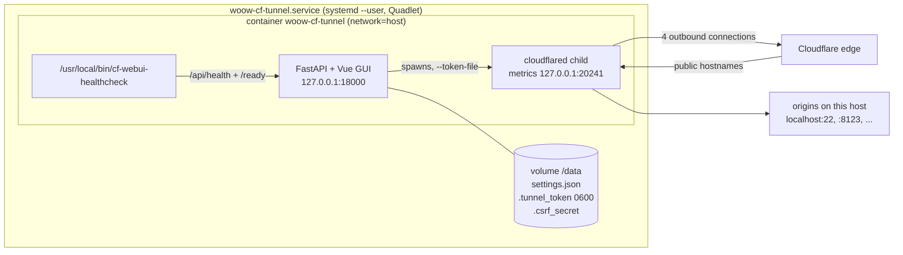
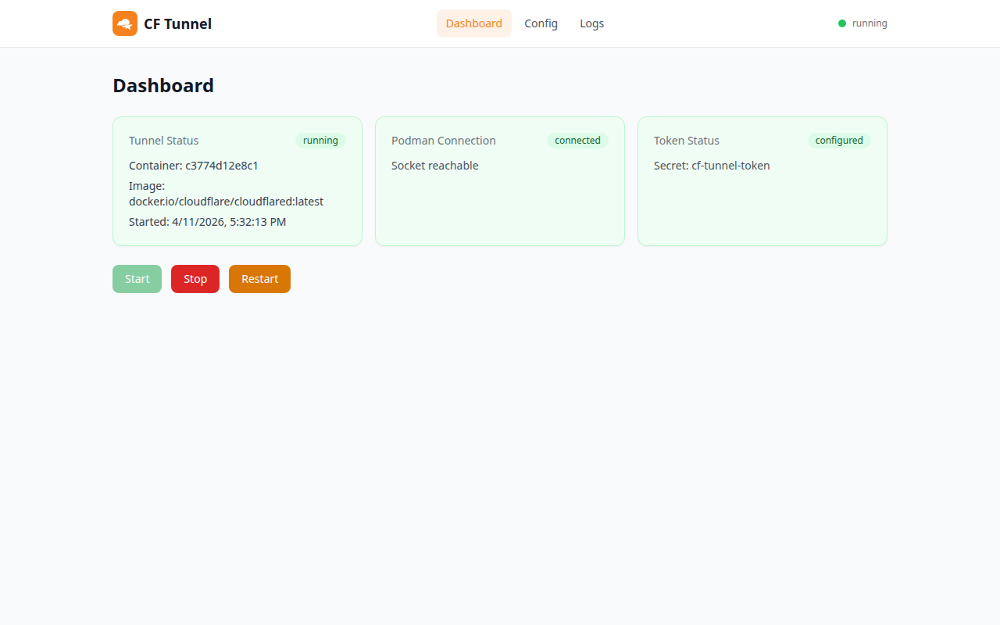
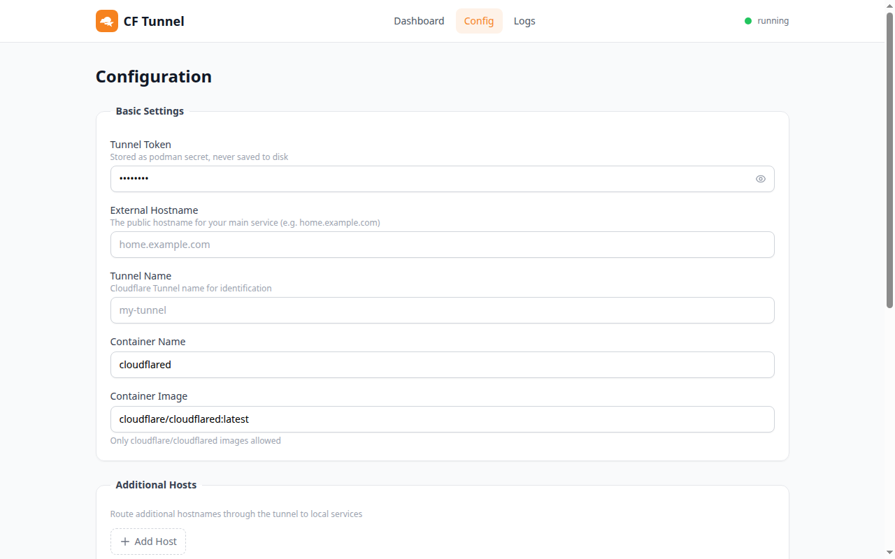
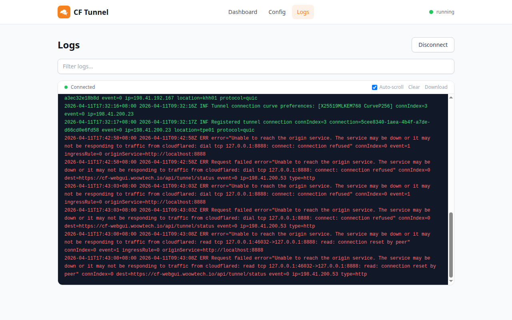

<p align="center">
  
</p>

<h1 align="center">Cloudflare Tunnel Web GUI</h1>

<p align="center">
  <strong>Run and manage a Cloudflare Tunnel from a browser. One container, supervised by systemd through Podman Quadlet.</strong>
</p>

<p align="center">
  <a href="README_zh-TW.md">繁體中文</a> &bull;
  <a href="#install">Install</a> &bull;
  <a href="#operate">Operate</a> &bull;
  <a href="#security">Security</a> &bull;
  <a href="#migrating-an-existing-deployment">Migrate</a> &bull;
  <a href="#api-reference">API</a>
</p>

<p align="center">
  
  
  
  
  
  
  
</p>

---

## Overview

A single container runs a FastAPI + Vue web GUI **and the `cloudflared` connector it
supervises as a child process**. You paste a tunnel token (or log in to Cloudflare from the
GUI), and the tunnel runs. There is no Podman socket, no second container, and no CLI.

`scripts/install.sh` installs it as **rootless Podman Quadlet units under user systemd**, so
it starts at boot (with linger), restarts when it crashes, and — new in 1.1.0 — restarts
when the *tunnel* dies while the backend is still up.


```mermaid
graph LR
    subgraph U["woow-cf-tunnel.service (systemd --user, Quadlet)"]
        subgraph C["container woow-cf-tunnel (network=host)"]
            API["FastAPI + Vue GUI<br/>127.0.0.1:18000"]
            CFD["cloudflared child<br/>metrics 127.0.0.1:20241"]
            HC["/usr/local/bin/cf-webui-healthcheck"]
        end
        VOL[("volume /data<br/>settings.json<br/>.tunnel_token 0600<br/>.csrf_secret")]
    end
    EDGE["Cloudflare edge"]
    ORIG["origins on this host<br/>localhost:22, :8123, ..."]

    API -->|spawns, --token-file| CFD
    API --- VOL
    CFD -->|4 outbound connections| EDGE
    EDGE -->|public hostnames| CFD --> ORIG
    HC -->|/api/health + /ready| API
```

**Liveness.** The container healthcheck requires the backend's `/api/health` **and**, when a
tunnel is configured, `cloudflared`'s `/ready` with at least one edge connection. Three
failures in a row (30s apart, after a 60s start period) make podman kill the container
(`HealthOnFailure=kill`); `Restart=always` brings it back and the app reconnects the tunnel.
Detection to recovery is roughly 1.5-2.5 minutes.

## Requirements

- Ubuntu 24.04 or similar, **rootless podman 4.9.3+** (`sudo apt install podman`)
- a user systemd session with linger (`sudo loginctl enable-linger $USER`)
- a Cloudflare account and a tunnel token, or the GUI login flow
- git, and enough space to build the image (~250 MB)

## Install

```bash
git clone https://github.com/WOOWTECH/Woow_cloudflare_tunnel_webgui.git
cd Woow_cloudflare_tunnel_webgui

scripts/install.sh          # first run: writes ~/.config/woow-cf-tunnel/woow-cf-tunnel.env
$EDITOR ~/.config/woow-cf-tunnel/woow-cf-tunnel.env
scripts/install.sh          # builds the image, installs the units, starts, smoke-tests
```

The image is **built locally** from this checkout and tagged
`localhost/woow-cf-tunnel:<VERSION>-<git-sha12>`; the unit pins that tag with `Pull=never`
(decision D3). Publishing to GHCR so hosts share one build is future work.

`~/.config/woow-cf-tunnel/woow-cf-tunnel.env` holds install-time settings only, no secrets:

| Key | Default | Meaning |
|---|---|---|
| `CF_DATA_VOLUME` | `cf_data` | the volume to adopt or create (existing deployments keep theirs) |
| `UVICORN_PORT` | `18000` | GUI/API port; the unit always binds it to 127.0.0.1 |
| `CF_METRICS_ADDR` | `127.0.0.1:20241` | cloudflared `--metrics`; must stay on loopback |
| `AUTH_LISTEN` | `127.0.0.1:8888` | optional Basic-auth proxy listen address |
| `AUTH_HTPASSWD` | `%h/.config/woow-cf-tunnel/htpasswd` | its password file |

Values are rendered into the unit files at install time (decision D2); the containers never
read this file. After editing it, run `scripts/upgrade.sh` (tunnel) or `scripts/install.sh`
(auth proxy).

### Open the GUI

It listens on 127.0.0.1 only. From your workstation:

```bash
ssh -L 18000:127.0.0.1:18000 <this host>
# then open http://localhost:18000
```

Then use the Config page to paste your tunnel token (token mode), or the Setup wizard to log
in to Cloudflare (local-managed mode).

## Operate

```bash
systemctl --user show woow-cf-tunnel.service -p ActiveState,SubState,NRestarts
journalctl --user -u woow-cf-tunnel.service -n 50
podman inspect woow-cf-tunnel -f '{{.State.Health.Status}}'
curl -s 127.0.0.1:20241/ready            # {"status":200,"readyConnections":4}
tests/smoke.sh                           # the full post-install check list
```

> **If this tunnel carries your SSH session, a restart drops it.** `scripts/install.sh`
> never restarts a running tunnel; `scripts/upgrade.sh` does the restart from a detached
> watchdog that rolls back on its own. Always keep a second way in (a tailnet, the LAN, a
> console) before touching it remotely.
>
> `migrate-legacy.sh`, `upgrade.sh`, `uninstall.sh` and `restore.sh` work out which path you
> are on by asking who holds the local end of your SSH connection
> (`ss -tnpH "sport = :<client port>"`): with `--tun=userspace-networking` tailscaled also
> re-dials 127.0.0.1:22, so a loopback client address proves nothing on its own — only the
> carrier process (`cloudflared` vs `tailscaled`) does. When the carrier cannot be identified
> they assume you are on the tunnel and say what they saw; `--allow-tunnel-session`
> (migrate) and `--force` (uninstall, restore) override.

Known behaviour: while your ISP or the edge is unreachable, the healthcheck keeps killing
and restarting the container about every two minutes until connectivity returns. Stopping
the tunnel from the GUI is undone the same way — on hosts where the tunnel is the remote
path, that is the intended bias.

## Upgrade

Change the repo (bump `VERSION`, the pinned `CLOUDFLARED_VERSION`, a unit or a setting),
commit, then:

```bash
scripts/upgrade.sh
```

It builds the new image while the old container keeps serving, snapshots the installed units
as the rollback target, backs up the data volume, records a baseline (edge connections,
ingress config version, hostname map, every public hostname's HTTP code), then hands the
restart to a detached `systemd-run --user` watchdog: install, restart, **gate within 180s**,
**soak 600s**, commit. Any failure, timeout or signal before the commit reinstalls the
previous units and restarts them. `scripts/upgrade.sh status|commit|abort|--rollback`
follow, end the soak early, or undo it.

## Backup and restore

```bash
scripts/backup.sh                      # ~/backups/woow-cf-tunnel/<volume>-<ts>.tar (+ .sha256)
scripts/restore.sh <tarball> [--replace]
```

> The tarball contains `/data`, **including the tunnel token**. It is written mode 0600 in a
> 0700 directory. Keep it on the host, delete old copies, and never copy it anywhere
> unencrypted: anyone who holds it can run your tunnel.

## Uninstall

```bash
scripts/uninstall.sh            # stops and removes the units; keeps the volume and images
scripts/uninstall.sh --purge    # also deletes the volume, after a final backup
```

## Migrating an existing deployment

**From a hand-written systemd unit or `podman run`** (for example a `cf-tunnel-webgui.service`
running `podman run ... -v cf_data:/data`):

```bash
# run this over a path that does NOT go through the tunnel (for example a tailnet)
scripts/migrate-legacy.sh preflight     # build + stage, checks, backup, baseline -> prints RUN
scripts/migrate-legacy.sh swap          # detached watchdog; returns immediately
scripts/migrate-legacy.sh status        # phase and result
scripts/migrate-legacy.sh commit        # optional: end the 10-minute soak early
scripts/migrate-legacy.sh --rollback    # manual rollback, until you clean up
```

The data volume is adopted in place (`VolumeName=`), so the token and settings survive. The
legacy unit is stopped and disabled but **its file is kept**, and the watchdog re-enables it
automatically if the new unit does not reach the baseline. Outage: roughly 35-50 seconds.
Knobs for other layouts: `LEGACY_UNIT`, `LEGACY_GUI_PORT`, `EXTRA_UNITS`, `HTTP_OVERRIDES`,
`RESCUE_CONTAINER`, `EXPECT_CONNS`.

### What happens to the legacy container

The new Quadlet container has a different name (`woow-cf-tunnel`), so the swap does not rename
the legacy one — it just stops it and disables its unit. That keeps a rollback available only
while nothing starts the container again. The user unit `podman-restart.service` runs
`podman start --all --filter restart-policy=always` at boot, so on a host where that unit is
**enabled** and the legacy container's restart policy is exactly `always`, the next reboot
brings a second `cloudflared` up on the same tunnel token, the same `/data` volume and the same
host ports (the legacy container is `--network=host`). podman 4.9.3 cannot repair that
afterwards: `podman update` only rewrites cgroup limits, and a restart policy is fixed at
create time.

`preflight` therefore asks `ql_rollback_strategy`, which reads this host's real state — never
its name — and prints the answer as `rollback shape:`.

| Answer | When | What the swap does | What a rollback does |
|---|---|---|---|
| `rename` | the unit is disabled, or the legacy container's policy is not `always` | leaves the container stopped, as before | starts its unit again |
| `capture` | the unit is enabled **and** the policy is `always` | `preflight` writes `<backup>/legacy-container/cf-tunnel-webgui/` (inspect, create command, image, policy, mounts) and the swap then removes the container with a plain `podman rm` — never `podman rm -v`, which would delete the anonymous volumes | `ql_recreate_container` recreates it stopped, with its original restart policy, **before** the legacy unit is started |

The capture is taken in `preflight`, before any downtime, so a container the library cannot
replay (an empty `CreateCommand` — created through the podman API rather than the CLI, which
is what a docker-compose-over-the-socket container looks like) is refused while the legacy
tunnel is still serving.

On `woowtechopenclaw` — the host this migration is aimed at — `podman-restart.service` *is*
enabled, but `cf-tunnel-webgui` is `unless-stopped`, a policy that unit's filter never matches.
So the shape there is `rename` today and the swap behaves exactly as it always did; the
`capture` shape exists because a policy can change and this script can be run on another host.

No `--commit`: the GUI keeps its settings, its tunnel token and its credentials in the `/data`
volume, which a plain `podman rm` never touches, and the live container's writable layer is
about 777 kB of `__pycache__`. The container id and the IP/MAC lease are not preserved.
`tests/harness/run-all.sh` covers both shapes (`migrate/openclaw/*`, `migrate/openclaw_always/*`).

**From compose:** stop the compose project, set `CF_DATA_VOLUME` to its volume (usually
`<project>_cf_data`), then run `scripts/install.sh`.

**Docker users:** this repo is Quadlet-only (decision D1). The last commit that ships
`docker-compose.yml` is tagged [`compose-final`](../../tree/compose-final)
(`git checkout compose-final`). Note that file published the GUI on `0.0.0.0:8888` with no
authentication — read [Security](#security) before you expose it.

## Security

- **The GUI has no login.** Anyone who reaches it can read your ingress configuration,
  replace the tunnel token, or stop the tunnel. **Never put it on a public hostname or the
  LAN without authentication in front.** In order of preference:
  1. an SSH port-forward (the default: the unit binds 127.0.0.1 and `tests/smoke.sh` fails
     if anything else listens on that port);
  2. **Cloudflare Access** on a tunnel hostname;
  3. the optional Basic-auth proxy: `scripts/auth-passwd.sh <user>` then
     `scripts/install.sh --with-auth` (nginx on `AUTH_LISTEN`, htpasswd validated at install,
     `$6$`/bcrypt/apr1 hashes, the unit asserts its files exist instead of crash-looping).
- **The tunnel token is app state, not a repo secret.** It lives in the data volume at
  `/data/.tunnel_token` (mode 0600) because the GUI's job is to set and replace it. Since
  1.1.0 cloudflared reads it with `--token-file`, so it is **not** in any process argv:
  `ps`, `podman top` and `systemctl --user status` no longer expose it. API responses only
  ever return `********`.
- **No secrets in the repo or in unit files.** `config/woow-cf-tunnel.env.example` holds
  settings only; `tests/no-secrets.sh` runs in CI.
- The container runs rootless with `--cap-drop=all` and `no-new-privileges`. The metrics
  endpoint must stay on 127.0.0.1: with host networking, `0.0.0.0` would publish the whole
  ingress map to the LAN (install.sh refuses it).
- Backups contain the token (see above).

## Repository layout

```
quadlet/          woow-cf-tunnel.container, woow-cf-tunnel-data.volume, render-vars
quadlet/optional/ woow-cf-tunnel-auth.container (Basic-auth proxy)
config/           woow-cf-tunnel.env.example, auth/auth-nginx.conf
scripts/          install, upgrade, uninstall, backup, restore, migrate-legacy,
                  auth-passwd, healthcheck.py, render-args.sh, lib/
backend/          FastAPI app: routers/{config,tunnel,logs,health,setup},
                  services/{process_manager,cloudflared_cli,token_store,config_builder,
                  config_manager,instances,validator}
frontend/         Vue 3 + Vite SPA
tests/            dryrun.sh (+ dryrun.local.sh), smoke.sh, harness/, pytest suite
```

`scripts/lib/quadlet-lib.sh` is the shared WOOWTECH Quadlet library, vendored unmodified and
checksummed in CI (decision D8). Do not edit it here.

## Testing

```bash
tests/dryrun.sh            # render + podman 4.9.3 generator + systemd-analyze + invariants
tests/harness/run-all.sh   # install/migrate/upgrade/uninstall against mocked podman+systemd
python -m pytest -m "not e2e" -q
tests/smoke.sh             # against a real install
```

No test creates a container except the CI end-to-end job, which also proves the liveness
chain (bogus token → unhealthy → `HealthOnFailure=kill` → `Restart=always`).

## API reference

| Endpoint | Returns |
|---|---|
| `GET /api/health` | `{"status":"ok","process_running":true}` |
| `GET /api/config` | `TunnelConfigRead`: `mode`, `tunnel_name`, `routes[]`, `catch_all_service`, `post_quantum`, `log_level`, `run_parameters`, `no_tls_verify`, `tunnel_token_masked` |
| `PUT /api/config` | same shape; `tunnel_token` is write-only and stored in `/data/.tunnel_token` |
| `POST /api/tunnel/{start,stop,restart}`, `GET /api/tunnel/status` | connector control |
| `GET /api/setup/state`, `POST /api/setup/*`, `WS /api/setup/login` | the local-managed wizard (refused in token mode) |
| `WS /ws/logs` | live cloudflared output |

Mutating calls need the CSRF double-submit cookie (`x-csrftoken`).

## Screenshots

<p align="center">
  
</p>
<p align="center">
  
</p>
<p align="center">
  
</p>

## Support

- Issues: [GitHub Issues](https://github.com/WOOWTECH/Woow_cloudflare_tunnel_webgui/issues)
- Changelog: [CHANGELOG.md](CHANGELOG.md)

## License

MIT.

---

<p align="center">
  Built with Vue 3 + FastAPI + Podman Quadlet by <a href="https://github.com/WOOWTECH">WOOWTECH</a>
</p>
