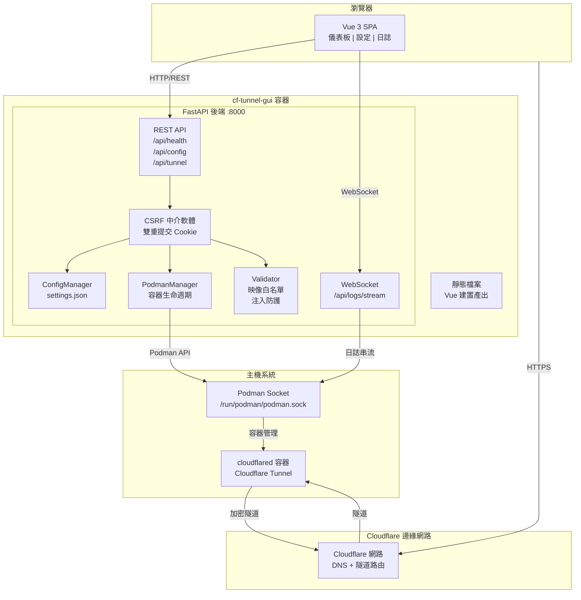
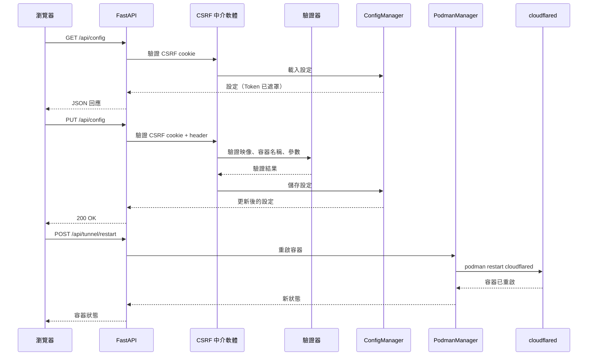
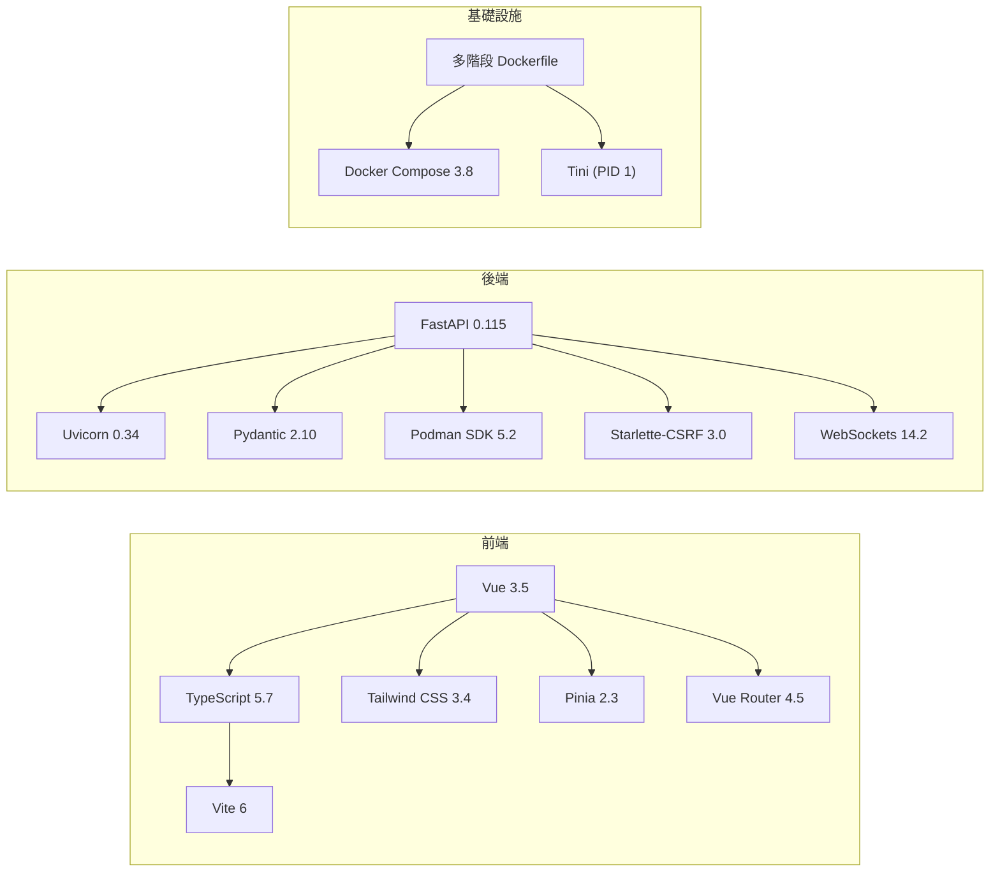
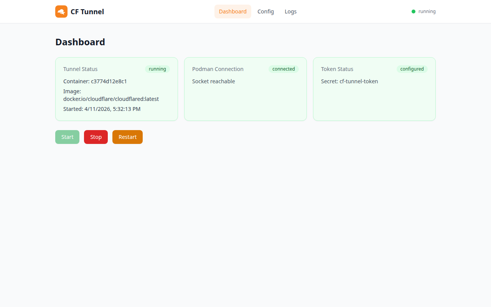
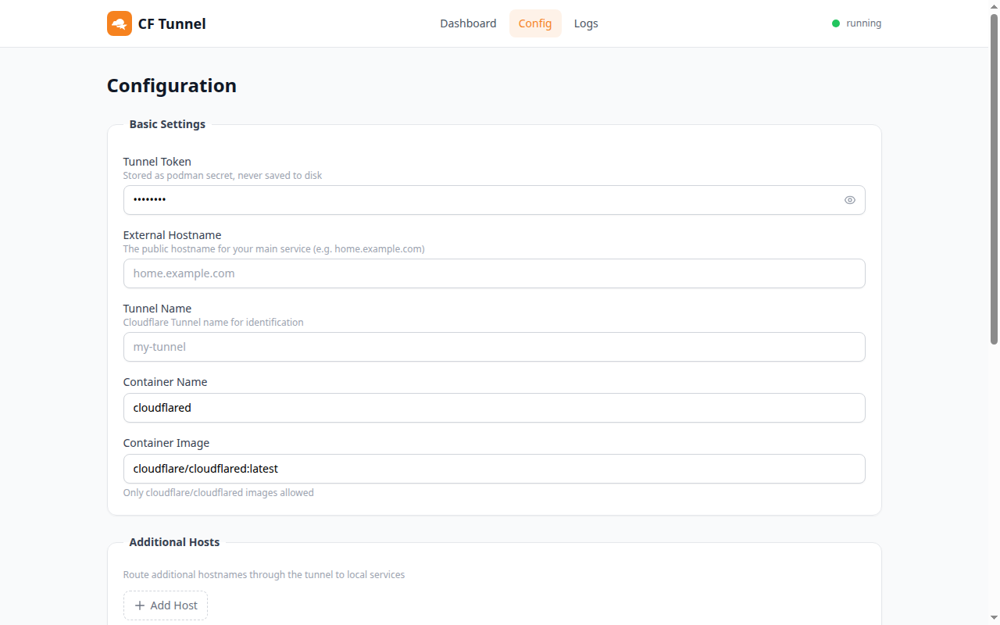
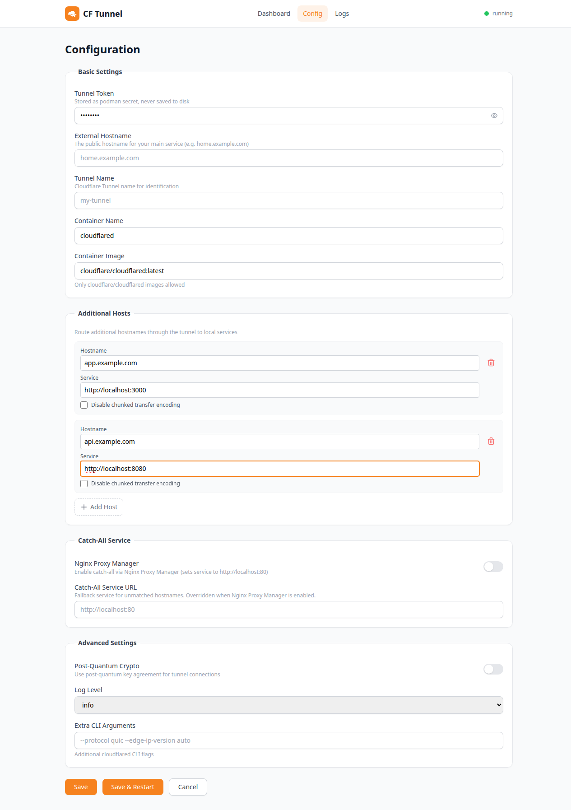
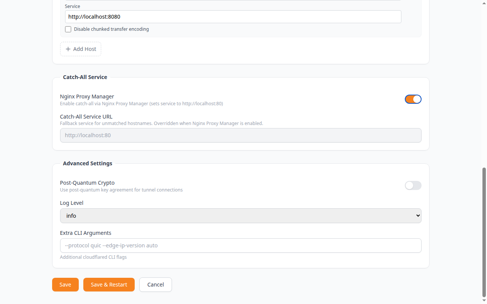
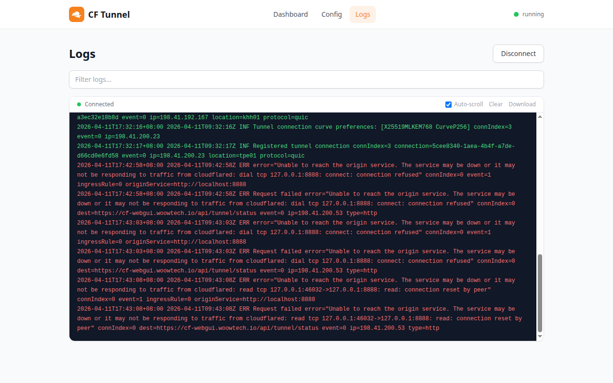

<p align="center">
  
</p>

<h1 align="center">Cloudflare Tunnel Web GUI for Podman</h1>

<p align="center">
  <strong>透過 Podman 管理 Cloudflare Tunnel 容器的現代化 Web 介面 — 完整相容 Home Assistant OS (HAOS) Cloudflared add-on 參數。</strong>
</p>

<p align="center">
  <a href="README.md">English</a> &bull;
  <a href="#%E6%88%AA%E5%9C%96%E5%B1%95%E7%A4%BA">截圖展示</a> &bull;
  <a href="#%E5%AE%89%E8%A3%9D">安裝</a> &bull;
  <a href="#%E6%9E%B6%E6%A7%8B">架構</a> &bull;
  <a href="#api-%E5%8F%83%E8%80%83">API 參考</a>
</p>

<p align="center">
  
  
  
  
  
  
  
</p>

---

## 概述

本專案提供一個**容器化的 Web GUI**，用於透過 [Podman](https://podman.io/) 管理 [Cloudflare Tunnel](https://developers.cloudflare.com/cloudflare-one/connections/connect-networks/) (`cloudflared`)。它以簡潔的瀏覽器介面取代手動 CLI 操作，提供隧道設定管理、容器生命週期控制，以及即時日誌串流功能。

### 為什麼需要這個專案？

| 挑戰 | 解決方案 |
|------|----------|
| 管理 `cloudflared` 需要 CLI 專業知識 | 直覺式 Web GUI 表單與開關 |
| 設定散落在各種 CLI 旗標中 | 集中式設定頁面，附帶驗證機制 |
| 無法即時了解隧道健康狀態 | 即時儀表板與狀態卡片 |
| 檢視日誌需要 `podman logs` | WebSocket 即時日誌串流與篩選 |
| HAOS Cloudflared add-on 參數不可用 | 完整 HAOS 參數相容性 |
| 手動處理 Token 有安全風險 | Token 以 Podman secret 儲存，永不寫入磁碟 |

## 功能特色

### 儀表板 (Dashboard)
- 即時隧道狀態監控（運行中 / 已停止 / 錯誤）
- Podman 連線健康檢查
- Token 設定狀態顯示
- 一鍵 啟動 / 停止 / 重啟 控制

### 設定管理 (Config)
- **基本設定** — 隧道 Token（遮罩顯示）、外部主機名稱、隧道名稱、容器名稱、容器映像（白名單驗證）
- **額外主機** — 動態新增/移除主機名稱到服務的路由對應，支援分塊傳輸編碼開關
- **Catch-All 服務** — 未匹配主機名稱的後備服務 URL，支援 Nginx Proxy Manager 整合開關
- **進階設定** — 後量子密碼學、8 級日誌詳細程度、額外 CLI 參數
- **安全防護** — Shell 注入防護、映像白名單、CSRF 雙重提交 Cookie 保護

### 日誌 (Logs)
- 基於 WebSocket 的即時日誌串流
- 篩選/搜尋與文字高亮
- 自動捲動與手動覆蓋
- 日誌下載與清除功能
- 連線狀態指示器

### HAOS 相容性

完整支援 [Home Assistant OS Cloudflared add-on](https://github.com/brenner-tobias/addon-cloudflared) 的所有設定參數：

| HAOS 參數 | GUI 欄位 | 狀態 |
|-----------|----------|------|
| `external_hostname` | 外部主機名稱 | 已支援 |
| `additional_hosts` | 額外主機（動態列表） | 已支援 |
| `tunnel_name` | 隧道名稱 | 已支援 |
| `catch_all_service` | Catch-All 服務 URL | 已支援 |
| `nginx_proxy_manager` | Nginx Proxy Manager 開關 | 已支援 |
| `post_quantum` | 後量子密碼學開關 | 已支援 |
| `log_level` | 日誌等級下拉選單（8 級） | 已支援 |

## 架構

### 系統架構圖



### 請求流程圖



### 技術堆疊



## 專案結構

```
Woow_cloudflare_tunnel_webgui/
├── backend/
│   ├── main.py                    # FastAPI 應用入口 + CSRF 中介軟體
│   ├── requirements.txt           # Python 依賴套件
│   ├── models/
│   │   └── schemas.py             # Pydantic 模型 + 驗證器
│   ├── routers/
│   │   ├── config.py              # GET/PUT /api/config
│   │   ├── health.py              # GET /api/health
│   │   ├── logs.py                # WebSocket /api/logs/stream
│   │   └── tunnel.py              # POST /api/tunnel/{start,stop,restart,status}
│   └── services/
│       ├── config_manager.py      # JSON 設定持久化 + 合併邏輯
│       ├── podman_manager.py      # Podman SDK 封裝
│       └── validator.py           # 映像白名單 + 注入防護
├── frontend/
│   ├── package.json               # Node.js 依賴套件
│   ├── vite.config.ts             # Vite 建置設定
│   ├── tailwind.config.js         # Tailwind CSS 設定
│   └── src/
│       ├── App.vue                # 根元件
│       ├── router.ts              # Vue Router 設定
│       ├── components/            # NavBar, StatusCard, LogViewer 等
│       ├── composables/           # useCsrf, useWebSocket
│       ├── pages/                 # Dashboard, Config, Logs
│       ├── stores/                # Pinia 狀態管理（config, tunnel）
│       └── types/                 # TypeScript 型別定義
├── tests/
│   ├── conftest.py                # 共用 fixtures + CSRF 處理
│   ├── test_schemas.py            # 60 項測試 — Pydantic 模型驗證
│   ├── test_config_manager.py     # 9 項測試 — 設定持久化
│   ├── test_config_api.py         # 25 項測試 — API 整合測試
│   ├── test_validator.py          # 25 項測試 — 安全性驗證器測試
│   └── test_e2e_live.py           # 21 項測試 — 即時容器 E2E 測試
├── docs/
│   └── screenshots/               # UI 截圖文檔
├── config/                        # 執行時設定（機敏資料已 gitignore）
├── Dockerfile                     # 多階段建置（Node + Python）
├── docker-compose.yml             # 生產環境部署
├── pytest.ini                     # 測試設定
├── README.md                      # 英文文檔
└── README_zh-TW.md                # 繁體中文文檔
```

## 截圖展示

### 儀表板 — 隧道狀態與控制

<p align="center">
  
</p>

即時監控隧道狀態、Podman 連線與 Token 設定。一鍵 啟動/停止/重啟 `cloudflared` 容器。

### 設定 — 基本設定

<p align="center">
  
</p>

隧道 Token（以 Podman secret 儲存，永不寫入磁碟）、外部主機名稱、隧道名稱、容器名稱，以及具白名單驗證的容器映像設定。

### 設定 — 額外主機與 Catch-All

<p align="center">
  
</p>

動態主機名稱到服務的路由對應，每個主機可個別設定分塊傳輸編碼。Catch-All 服務支援 Nginx Proxy Manager 整合 — 啟用 NPM 時，服務 URL 欄位自動鎖定為 `http://localhost:80`。

### 設定 — 進階設定

<p align="center">
  
</p>

後量子密碼學開關、8 級日誌詳細程度下拉選單（trace/debug/info/notice/warn/warning/error/fatal），以及額外 CLI 參數供進階 `cloudflared` 旗標使用。

### 日誌 — 即時串流

<p align="center">
  
</p>

基於 WebSocket 的即時日誌檢視器，支援篩選搜尋、自動捲動、清除與下載功能。色彩標示日誌等級，方便快速視覺掃描。

## 安裝

### 前置需求

- **Docker** 或 **Podman** 已安裝並運行
- **Cloudflare 帳號**（[免費註冊](https://dash.cloudflare.com/sign-up)）

`cloudflared` 二進位已內建於映像中，因此**不需另外安裝、也不需掛載 Podman/Docker socket**，全部在單一容器內運行。

### 使用 Docker Compose 快速啟動

```bash
# 1. 複製倉庫
git clone https://github.com/WOOWTECH/Woow_cloudflare_tunnel_webgui.git
cd Woow_cloudflare_tunnel_webgui

# 2. 建置並啟動（主機 8888 → 容器 8000）
docker compose up -d --build   # 或：podman compose up -d --build

# 3. 開啟 GUI
open http://localhost:8888
```

### 手動建置與執行

映像為單容器,在 Docker 與 Podman 上指令完全相同,僅二進位名稱不同：

```bash
# 建置
docker build -t cf-webui:latest .          # 或：podman build -t cf-webui:latest .

# 執行 — 主機 8888 對應容器 8000,狀態持久化於 /data volume
docker run -d \
  --name cf-tunnel-webgui \
  -p 8888:8000 \
  -v cf_data:/data \
  -e CSRF_SECRET=$(openssl rand -hex 32) \
  cf-webui:latest
# Podman：將 `docker` 換成 `podman` 即可,其餘相同。
```

`/data` 存放隧道憑證、路由設定與本地 cloudflared 狀態 —— 請以 named volume 保存,確保容器重建後資料不遺失。

### 運行模式

| 模式 | 使用時機 | 你需要提供 |
|------|----------|------------|
| **本地管理（Local-managed）** | 想讓 GUI 幫你建立並運行隧道 | 於 GUI 內登入 Cloudflare（自助流程,見下） |
| **Token** | 你已從 Cloudflare 儀表板取得隧道 Token | 在設定頁貼上隧道 Token |

#### Cloudflare 登入（本地管理模式的自助流程）

1. 在 GUI 開始登入流程 —— 畫面會顯示一組 Cloudflare 網址/代碼。
2. 用瀏覽器開啟該網址,登入並授權對應 zone。
3. 憑證會寫入 `/data`,GUI 隨即為你建立並啟動隧道。

> **刪除路由不會移除其 DNS 紀錄。** 在 GUI 刪除某個主機名稱/路由後,對應的 CNAME 仍會留在你的 Cloudflare DNS 中。請至 Cloudflare 儀表板手動刪除,才能完全停用該主機名稱。

### 環境變數

| 變數 | 預設值 | 說明 |
|------|--------|------|
| `CSRF_SECRET` | 自動產生 | CSRF Token 簽名用金鑰 |

## 設定指南

### 首次設定

1. 在瀏覽器開啟 `http://localhost:8888`
2. 導航至**設定 (Config)** 頁面
3. 輸入你的 **Cloudflare Tunnel Token**（以 Podman secret 儲存）
4. 設定容器名稱與映像
5. 點擊 **Save & Restart** 啟動隧道

### 額外主機設定

透過單一隧道路由多個主機名稱：

1. 在「額外主機」區塊點擊 **+ Add Host**
2. 輸入主機名稱（例如 `app.example.com`）
3. 輸入後端服務 URL（例如 `http://localhost:3000`）
4. 可選擇開啟 **Disable chunked transfer encoding**
5. 重複以上步驟新增更多主機，然後點擊 **Save**

### Nginx Proxy Manager 整合

如果你使用 Nginx Proxy Manager：

1. 在「Catch-All 服務」區塊啟用 **Nginx Proxy Manager** 開關
2. Catch-All 服務 URL 自動設定為 `http://localhost:80`
3. NPM 負責 SSL 終止與反向代理

## 安全性

### 防禦層級

```
┌─────────────────────────────────────────────────┐
│                 CSRF 防護                        │
│          雙重提交 Cookie 模式                     │
├─────────────────────────────────────────────────┤
│               輸入驗證                           │
│    Pydantic field_validator + 正則表達式           │
├─────────────────────────────────────────────────┤
│              映像白名單                          │
│   僅允許 cloudflare/cloudflared 映像              │
├─────────────────────────────────────────────────┤
│             注入防護                             │
│  阻擋 Shell 特殊字元：; & | ` $() (){}            │
├─────────────────────────────────────────────────┤
│             Token 安全                           │
│   以 Podman secret 儲存，永不寫入磁碟              │
│   API 回應僅回傳遮罩值                            │
└─────────────────────────────────────────────────┘
```

| 攻擊向量 | 防護機制 |
|----------|----------|
| CSRF | 雙重提交 Cookie + `SameSite=Lax` |
| Shell 注入（extra_args） | 正則阻擋 `;`、`&`、`|`、`` ` ``、`$()`、`(){}` |
| 惡意容器映像 | 白名單：僅允許 `docker.io` 的 `cloudflare/cloudflared` |
| 容器名稱注入 | Docker 相容名稱正則：`[a-zA-Z0-9][a-zA-Z0-9_.-]*` |
| Token 洩漏 | 以 Podman secret 儲存；API 回傳 `********` |
| XSS | Vue 3 自動跳脫 + Content Security Policy |

## API 參考

### 健康檢查

```http
GET /api/health
```

```json
{
  "status": "ok",
  "podman_connected": true,
  "tunnel_status": "running"
}
```

### 取得設定

```http
GET /api/config
```

```json
{
  "tunnel_token_secret": "cf-tunnel-token",
  "tunnel_token_masked": "********",
  "post_quantum": false,
  "log_level": "info",
  "extra_args": "",
  "container_name": "cloudflared",
  "container_image": "cloudflare/cloudflared:latest",
  "external_hostname": "",
  "additional_hosts": [],
  "tunnel_name": "",
  "catch_all_service": "",
  "nginx_proxy_manager": false
}
```

### 更新設定

```http
PUT /api/config
Content-Type: application/json
X-CSRFToken: <token>

{
  "container_image": "cloudflare/cloudflared:latest",
  "container_name": "cloudflared",
  "log_level": "debug",
  "external_hostname": "home.example.com",
  "additional_hosts": [
    {
      "hostname": "app.example.com",
      "service": "http://localhost:3000",
      "disableChunkedEncoding": false
    }
  ],
  "nginx_proxy_manager": true
}
```

### 隧道控制

```http
POST /api/tunnel/start
POST /api/tunnel/stop
POST /api/tunnel/restart
GET  /api/tunnel/status
```

### 日誌串流

```javascript
const ws = new WebSocket('ws://localhost:8888/api/logs/stream');
ws.onmessage = (event) => console.log(event.data);
```

## 測試

### 測試套件概覽

| 測試檔案 | 測試數 | 涵蓋範圍 |
|----------|--------|----------|
| `test_schemas.py` | 60 | Pydantic 模型、LogLevel 列舉、AdditionalHost、注入防護 |
| `test_config_api.py` | 25 | Config API GET/PUT、CSRF、錯誤碼 400/422 |
| `test_validator.py` | 25 | 映像白名單、Token 格式、Shell 注入（6 種向量） |
| `test_config_manager.py` | 9 | 設定持久化、合併邏輯、遷移 |
| `test_e2e_live.py` | 21 | 針對即時容器的端對端測試 |
| **合計** | **140** | **100% 通過率** |

### 執行測試

```bash
# 全部測試（unit + integration + E2E）
python3 -m pytest tests/ -v

# 僅 unit/integration（不需要容器）
python3 -m pytest tests/ -m "not e2e" -v

# 僅 E2E（需要容器運行於 localhost:8888）
python3 -m pytest tests/ -m e2e -v
```

### 安全性測試涵蓋

- 6 種 Shell 注入攻擊向量已阻擋
- 8 種惡意映像名稱已拒絕
- 6 種 Token 注入模式已阻擋
- 7 種無效容器名稱格式已拒絕
- CSRF 繞過嘗試已阻擋

## 技術堆疊

### 後端

| 套件 | 版本 | 用途 |
|------|------|------|
| FastAPI | 0.115.6 | 非同步 REST API 框架 |
| Uvicorn | 0.34.0 | ASGI 伺服器 |
| Pydantic | 2.10.4 | 資料驗證與序列化 |
| Podman SDK | 5.2+ | 透過 Podman API 管理容器 |
| Starlette-CSRF | 3.0.0 | CSRF 防護中介軟體 |
| WebSockets | 14.2 | 即時日誌串流 |
| Aiofiles | 24.1.0 | 非同步檔案操作 |

### 前端

| 套件 | 版本 | 用途 |
|------|------|------|
| Vue | 3.5.13 | 響應式 UI 框架 |
| Vue Router | 4.5.0 | 客戶端路由 |
| Pinia | 2.3.0 | 狀態管理 |
| TypeScript | 5.7.3 | 型別安全 JavaScript |
| Vite | 6.0.7 | 建置工具與開發伺服器 |
| Tailwind CSS | 3.4.17 | 工具優先 CSS 框架 |
| Heroicons | 2.2.0 | SVG 圖示庫 |

### 基礎設施

| 元件 | 用途 |
|------|------|
| 多階段 Dockerfile | Node.js 建置 + Python 運行時 |
| Docker Compose 3.8 | 生產環境部署 |
| Tini | PID 1 初始化系統，正確處理信號 |
| Podman Socket | Rootless 容器管理 |

## 變更日誌

### v1.0.0 (2026-04-11)

**新功能**
- 完整 HAOS Cloudflared add-on 參數相容性
- 額外主機動態路由，支援分塊傳輸編碼開關
- Catch-All 服務，支援 Nginx Proxy Manager 整合
- 後量子密碼學開關
- 8 級日誌詳細程度（trace/debug/info/notice/warn/warning/error/fatal）
- 隧道名稱與外部主機名稱設定

**安全性**
- CSRF 雙重提交 Cookie 防護
- Shell 注入防護（6 種攻擊向量）
- 容器映像白名單驗證
- Token 以 Podman secret 儲存，永不寫入磁碟

**測試**
- 140 項自動化測試（100% 通過率）
- 單元、整合與端對端測試涵蓋
- 安全性攻擊向量驗證

## 支援

- **Issues**: [GitHub Issues](https://github.com/WOOWTECH/Woow_cloudflare_tunnel_webgui/issues)
- **Email**: support@woowtech.io
- **Demo**: 透過 Cloudflare Tunnel 部署

## 授權

本專案採用 MIT 授權條款。

---

<p align="center">
  以 Vue 3 + FastAPI + Podman 建置，由 <a href="https://github.com/WOOWTECH">WOOWTECH</a> 開發
</p>
