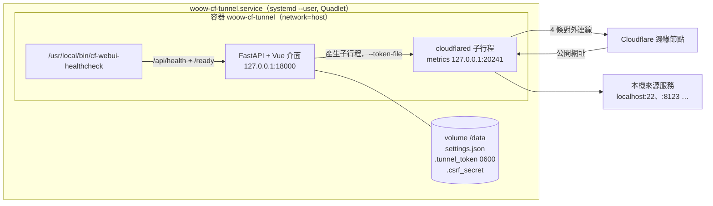

<p align="center">
  
</p>

<h1 align="center">Cloudflare Tunnel Web GUI</h1>

<p align="center">
  <strong>用瀏覽器管理 Cloudflare Tunnel。單一容器，透過 Podman Quadlet 交給 systemd 監管。</strong>
</p>

<p align="center">
  <a href="README.md">English</a> &bull;
  <a href="#安裝">安裝</a> &bull;
  <a href="#日常操作">操作</a> &bull;
  <a href="#安全性">安全性</a> &bull;
  <a href="#從既有部署遷移">遷移</a> &bull;
  <a href="#api-參考">API</a>
</p>

<p align="center">
  
  
  
  
  
  
  
</p>

---

## 概述

單一容器同時執行 FastAPI + Vue 的網頁介面，**以及它以子行程監管的 `cloudflared` 連接器**。
貼上 tunnel token（或在介面上登入 Cloudflare），隧道就會運作。不需要 Podman socket、
不需要第二個容器，也不需要下指令。

`scripts/install.sh` 會把它安裝成 **rootless Podman Quadlet 單元，由使用者層級的 systemd 管理**：
開機自動啟動（需 linger）、當掉會自動重啟，而且從 1.1.0 起，**後端還活著但隧道死掉時也會自救**。


```mermaid
graph LR
    subgraph U["woow-cf-tunnel.service（systemd --user, Quadlet）"]
        subgraph C["容器 woow-cf-tunnel（network=host）"]
            API["FastAPI + Vue 介面<br/>127.0.0.1:18000"]
            CFD["cloudflared 子行程<br/>metrics 127.0.0.1:20241"]
            HC["/usr/local/bin/cf-webui-healthcheck"]
        end
        VOL[("volume /data<br/>settings.json<br/>.tunnel_token 0600<br/>.csrf_secret")]
    end
    EDGE["Cloudflare 邊緣節點"]
    ORIG["本機來源服務<br/>localhost:22、:8123 …"]

    API -->|產生子行程，--token-file| CFD
    API --- VOL
    CFD -->|4 條對外連線| EDGE
    EDGE -->|公開網址| CFD --> ORIG
    HC -->|/api/health + /ready| API
```

**存活偵測。** 容器健康檢查同時要求後端 `/api/health`，**以及**（當隧道已設定時）
cloudflared `/ready` 至少有一條邊緣連線。連續三次失敗（每 30 秒一次，啟動寬限 60 秒）
podman 就會殺掉容器（`HealthOnFailure=kill`），`Restart=always` 再把它拉回來，
應用程式隨即重新接上隧道。從偵測到恢復大約 1.5–2.5 分鐘。

## 環境需求

- Ubuntu 24.04 或同等系統，**rootless podman 4.9.3 以上**（`sudo apt install podman`）
- 使用者 systemd session 並開啟 linger（`sudo loginctl enable-linger $USER`）
- Cloudflare 帳號與 tunnel token，或使用介面上的登入流程
- git，以及約 250 MB 建置映像檔的空間

## 安裝

```bash
git clone https://github.com/WOOWTECH/Woow_cloudflare_tunnel_webgui.git
cd Woow_cloudflare_tunnel_webgui

scripts/install.sh          # 第一次執行：建立 ~/.config/woow-cf-tunnel/woow-cf-tunnel.env
$EDITOR ~/.config/woow-cf-tunnel/woow-cf-tunnel.env
scripts/install.sh          # 建置映像檔、安裝單元、啟動並跑冒煙測試
```

映像檔在**本機建置**，標籤是 `localhost/woow-cf-tunnel:<VERSION>-<git-sha12>`，
unit 以 `Pull=never` 釘死該標籤（決策 D3）。之後改由 CI 發佈到 GHCR 共用同一份映像檔。

`~/.config/woow-cf-tunnel/woow-cf-tunnel.env` 只放安裝時的設定，沒有任何祕密：

| 設定 | 預設值 | 用途 |
|---|---|---|
| `CF_DATA_VOLUME` | `cf_data` | 要沿用或建立的 volume（既有部署沿用原本那個） |
| `UVICORN_PORT` | `18000` | 介面/API 連接埠；unit 一律綁在 127.0.0.1 |
| `CF_METRICS_ADDR` | `127.0.0.1:20241` | cloudflared `--metrics`，必須留在 loopback |
| `AUTH_LISTEN` | `127.0.0.1:8888` | 選配 Basic-auth 代理的監聽位址 |
| `AUTH_HTPASSWD` | `%h/.config/woow-cf-tunnel/htpasswd` | 其密碼檔 |

這些值在安裝時寫進 unit 檔（決策 D2），容器本身不會讀這個檔案。改完之後，
執行 `scripts/upgrade.sh`（隧道）或 `scripts/install.sh`（驗證代理）套用。

### 開啟介面

它只監聽 127.0.0.1。在自己的電腦上：

```bash
ssh -L 18000:127.0.0.1:18000 <這台主機>
# 然後開啟 http://localhost:18000
```

接著在 Config 頁貼上 tunnel token（token 模式），或用上線精靈登入 Cloudflare（本地管理模式）。

## 日常操作

```bash
systemctl --user show woow-cf-tunnel.service -p ActiveState,SubState,NRestarts
journalctl --user -u woow-cf-tunnel.service -n 50
podman inspect woow-cf-tunnel -f '{{.State.Health.Status}}'
curl -s 127.0.0.1:20241/ready            # {"status":200,"readyConnections":4}
tests/smoke.sh                           # 完整的安裝後檢查
```

> **如果 SSH 是走這條隧道進來的，重啟會把你自己斷線。** `scripts/install.sh` 永遠不會重啟
> 執行中的隧道；`scripts/upgrade.sh` 則由背景監看程式執行重啟，失敗會自動回滾。
> 遠端操作前，一定要先確保有第二條路（tailnet、區域網路或實體主控台）。

已知行為：當你的 ISP 或邊緣節點連不上時，健康檢查會大約每兩分鐘殺掉並重啟容器一次，
直到連線恢復。從介面按下停止隧道也會被同樣機制還原——在「隧道就是遠端路徑」的主機上，
這是刻意的取捨。

## 升級

修改 repo（調整 `VERSION`、釘選的 `CLOUDFLARED_VERSION`、unit 或設定），commit，然後：

```bash
scripts/upgrade.sh
```

它會在舊容器持續服務時建置新映像檔，把目前安裝的 unit 存成回滾目標，備份資料 volume，
記錄基準（邊緣連線數、ingress 設定版本、主機名稱對應表、每個公開網址的 HTTP 回應碼），
再把重啟交給背景的 `systemd-run --user` 監看程式：安裝 → 重啟 → **180 秒內通過閘門檢查** →
**觀察 600 秒** → 定案。定案前任何失敗、逾時或訊號，都會重新安裝先前的 unit 並重啟。
`scripts/upgrade.sh status|commit|abort|--rollback` 可追蹤、提早結束觀察期或還原。

## 備份與還原

```bash
scripts/backup.sh                      # ~/backups/woow-cf-tunnel/<volume>-<時間>.tar（含 .sha256）
scripts/restore.sh <tar 檔> [--replace]
```

> 這個 tar 檔包含 `/data`，**裡面有 tunnel token**。檔案權限 0600、目錄 0700。
> 請留在本機、定期刪除舊檔，也絕對不要未加密就往外複製：拿到它的人就能接管你的隧道。

## 移除

```bash
scripts/uninstall.sh            # 停止並移除 unit；保留 volume 與映像檔
scripts/uninstall.sh --purge    # 先做最後一次備份，再刪掉 volume
```

## 從既有部署遷移

**從手寫的 systemd unit 或 `podman run`**（例如 `cf-tunnel-webgui.service` 跑
`podman run ... -v cf_data:/data`）：

```bash
# 請走「不經過這條隧道」的路徑執行（例如 tailnet）
scripts/migrate-legacy.sh preflight     # 建置+暫存、檢查、備份、基準 → 印出 RUN
scripts/migrate-legacy.sh swap          # 背景監看程式，指令立刻返回
scripts/migrate-legacy.sh status        # 查看階段與結果
scripts/migrate-legacy.sh commit        # 選用：提早結束 10 分鐘觀察期
scripts/migrate-legacy.sh --rollback    # 清理前都還可以手動回滾
```

資料 volume 會原地沿用（`VolumeName=`），token 與設定都不會動。舊 unit 會被停用並
`disable`，但**檔案保留**；只要新 unit 沒有達到基準，監看程式會自動把它重新啟用。
中斷時間約 35–50 秒。其他佈局可用這些環境變數：`LEGACY_UNIT`、`LEGACY_GUI_PORT`、
`EXTRA_UNITS`、`HTTP_OVERRIDES`、`RESCUE_CONTAINER`、`EXPECT_CONNS`。

**從 compose 遷移**：先停掉 compose 專案，把 `CF_DATA_VOLUME` 設成它的 volume
（通常是 `<專案名>_cf_data`），再執行 `scripts/install.sh`。

**Docker 使用者**：本 repo 只保留 Quadlet（決策 D1）。最後一版含 `docker-compose.yml`
的 commit 打了 [`compose-final`](../../tree/compose-final) 標籤（`git checkout compose-final`）。
請注意那份檔案把介面開在 `0.0.0.0:8888` 且沒有任何驗證，對外之前請先讀
[安全性](#安全性)。

## 安全性

- **這個介面沒有登入機制。** 任何連得到它的人都能讀取 ingress 設定、替換 tunnel token，
  或停掉隧道。**沒有加上驗證之前，絕對不要把它掛上公開網址或區域網路。**
  建議順序：
  1. SSH 埠轉發（預設：unit 綁 127.0.0.1，`tests/smoke.sh` 一旦發現其他位址監聽就會失敗）；
  2. 在 tunnel 網址前面加上 **Cloudflare Access**；
  3. 選配的 Basic-auth 代理：`scripts/auth-passwd.sh <使用者>` 之後
     `scripts/install.sh --with-auth`（nginx 監聽 `AUTH_LISTEN`，安裝時驗證 htpasswd 格式，
     接受 `$6$`/bcrypt/apr1；unit 以 Assert 檢查檔案存在，不會陷入重啟迴圈）。
- **tunnel token 是應用程式狀態，不是 repo 裡的祕密。** 它放在資料 volume 的
  `/data/.tunnel_token`（權限 0600），因為「設定與更換 token」正是這個產品的功能。
  從 1.1.0 起 cloudflared 以 `--token-file` 讀取，所以**不會出現在任何行程參數裡**：
  `ps`、`podman top`、`systemctl --user status` 都看不到它。API 一律只回傳 `********`。
- **repo 與 unit 檔內沒有任何祕密。** `config/woow-cf-tunnel.env.example` 只有設定值，
  CI 會執行 `tests/no-secrets.sh`。
- 容器以 rootless 執行，`--cap-drop=all` 且 `no-new-privileges`。metrics 位址必須留在
  127.0.0.1：在 host 網路模式下，`0.0.0.0` 會把整份 ingress 對應表公開給區域網路
  （install.sh 會拒絕）。
- 備份檔含有 token（見上）。

## 專案結構

```
quadlet/          woow-cf-tunnel.container、woow-cf-tunnel-data.volume、render-vars
quadlet/optional/ woow-cf-tunnel-auth.container（Basic-auth 代理）
config/           woow-cf-tunnel.env.example、auth/auth-nginx.conf
scripts/          install、upgrade、uninstall、backup、restore、migrate-legacy、
                  auth-passwd、healthcheck.py、render-args.sh、lib/
backend/          FastAPI：routers/{config,tunnel,logs,health,setup}、
                  services/{process_manager,cloudflared_cli,token_store,config_builder,
                  config_manager,instances,validator}
frontend/         Vue 3 + Vite SPA
tests/            dryrun.sh（含 dryrun.local.sh）、smoke.sh、harness/、pytest 測試
```

`scripts/lib/quadlet-lib.sh` 是 WOOWTECH 共用的 Quadlet 函式庫，原封不動 vendored 進來，
CI 會比對雜湊（決策 D8）。請勿在這裡修改它。

## 測試

```bash
tests/dryrun.sh            # 套值 + podman 4.9.3 產生器 + systemd-analyze + 不變條件
tests/harness/run-all.sh   # 以模擬的 podman/systemd 跑 install/migrate/upgrade/uninstall
python -m pytest -m "not e2e" -q
tests/smoke.sh             # 針對實際安裝
```

除了 CI 的端對端工作，沒有任何測試會建立容器；那個工作同時驗證存活鏈
（假 token → 不健康 → `HealthOnFailure=kill` → `Restart=always`）。

## API 參考

| 端點 | 回傳 |
|---|---|
| `GET /api/health` | `{"status":"ok","process_running":true}` |
| `GET /api/config` | `TunnelConfigRead`：`mode`、`tunnel_name`、`routes[]`、`catch_all_service`、`post_quantum`、`log_level`、`run_parameters`、`no_tls_verify`、`tunnel_token_masked` |
| `PUT /api/config` | 同樣結構；`tunnel_token` 只能寫入，存到 `/data/.tunnel_token` |
| `POST /api/tunnel/{start,stop,restart}`、`GET /api/tunnel/status` | 連接器控制 |
| `GET /api/setup/state`、`POST /api/setup/*`、`WS /api/setup/login` | 本地管理上線精靈（token 模式會拒絕） |
| `WS /ws/logs` | cloudflared 即時輸出 |

會改變狀態的請求需要 CSRF double-submit cookie（`x-csrftoken`）。

## 截圖

<p align="center">
  
</p>
<p align="center">
  
</p>
<p align="center">
  
</p>

## 支援

- 問題回報：[GitHub Issues](https://github.com/WOOWTECH/Woow_cloudflare_tunnel_webgui/issues)
- 變更紀錄：[CHANGELOG.md](CHANGELOG.md)

## 授權

MIT。

---

<p align="center">
  由 <a href="https://github.com/WOOWTECH">WOOWTECH</a> 以 Vue 3 + FastAPI + Podman Quadlet 打造
</p>
